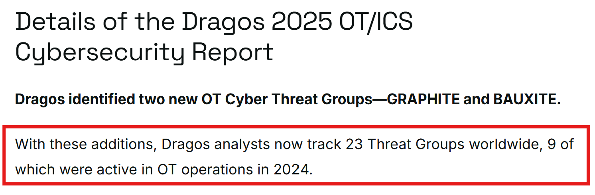

# Dragos Trivia - Q1

**Score：** 200

**Challenge：**  
The 9th Annual Year In Review OT/ICS Cybersecurity Report (2025) report summarizes cybersecurity headlines, the ICS/OT threat landscape, case studies from the Dragos frontlines, and security trends seen at industrial organizations. Dragos tracked 23 threat groups targeting industrial control organizations.

How many threat groups were active in 2024?

**Hits：**  
* Head over to the Dragos website and look at the resources.

---
**Flag：** `9`  
**Write-Up：**  
根據[《Dragos Reports OT/ICS Cyber Threats Escalate Amid Geopolitical Conflicts and Increasing Ransomware Attacks》](https://www.dragos.com/resources/press-release/dragos-reports-ot-ics-cyber-threats-escalate-amid-geopolitical-conflicts-and-increasing-ransomware-attacks)，Dragos 分析師追蹤的 23 個 OT 威脅團體中，有 `9` 個在 2024 年處於活躍狀態。

