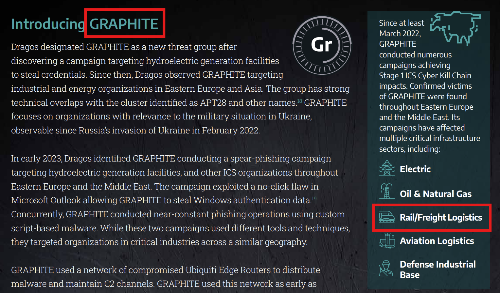

# Dragos Trivia - Q3

**Score：** 200

**Challenge：**  
Dragos tracked new Threat Groups in 2024. Which new Threat Group has been known to affect the Rail Industry?

**Hits：**  
* None

---
**Flag：**  `GRAPHITE`  
**Write-Up：**  
根據[《2025 OT/ICS CYBERSECURITY REPORT》]( https://edgewaterit.com/wp-content/uploads/2025/04/Dragos-2025-OT-Cybersecurity-Report-A-Year-in-Review.pdf)，`GRAPHITE` 是 Dragos 於 2024 年識別出的新威脅團體，主要針對鐵路貨運在內的物流部門進行攻擊。

