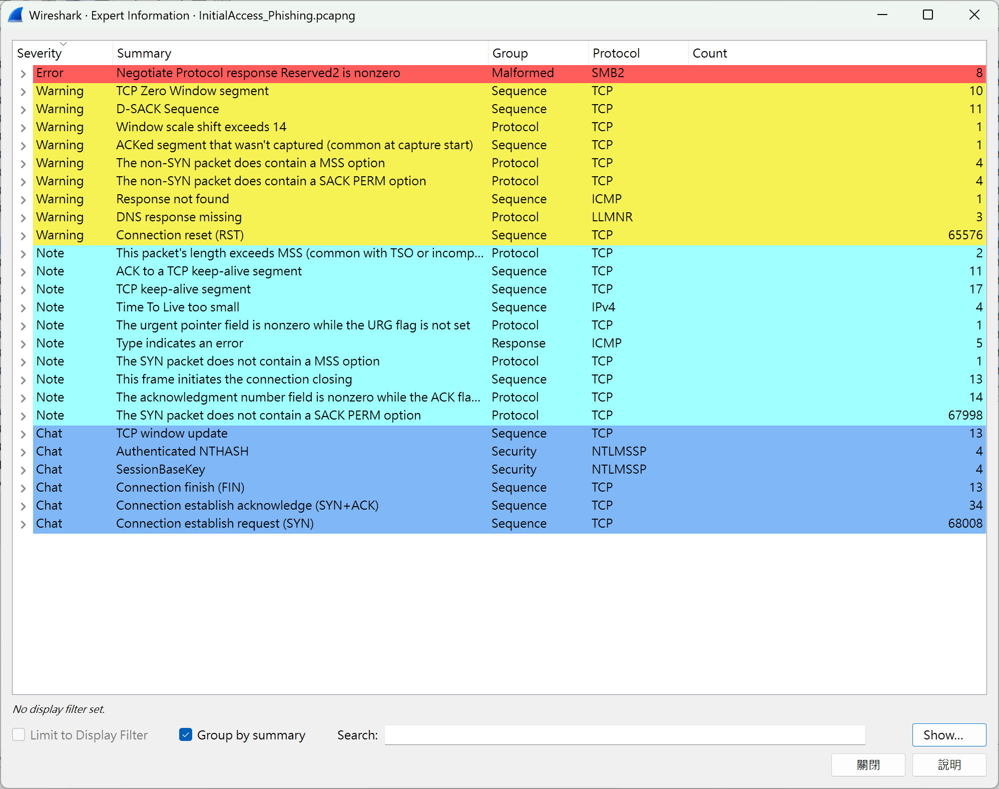
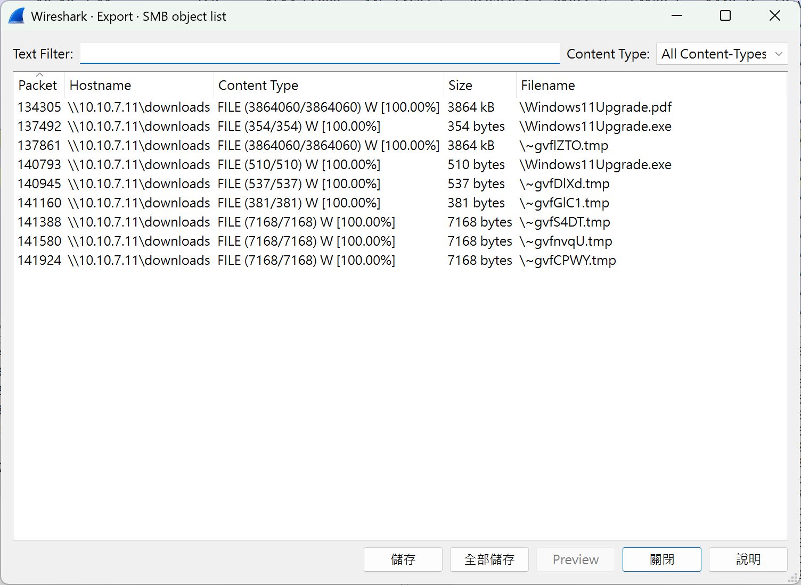

# Undercover Ops

**Score：** 200

**Challenge：**  
Use the attached PCAP to answer the next two questions.

Sophia, a project manager at ACME Corp., just received an email from her “IT team”, informing her that her current Windows 10 host needs to be updated to the latest, approved OS - Windows 11. The “IT team” placed proper instructions in her Downloads directly and asked Sophia to follow the necessary steps to complete the update.

Reviewing the PCAP will show that multiple files were transferred across the network. What was the first filename transferred onto Sophia’s host?

**Hits：**  
* Is there a place in Wireshark where we can view transferred files?

---
**Flag：**  Windows11Upgrade.pdf  
**Write-Up：**  

從 Wireshark 的 `Analyze` -> `Expert Information` 發現有 SMB2 malformed 封包。

`File` -> `Export Objects` -> `SMB` 看到 Flag。

