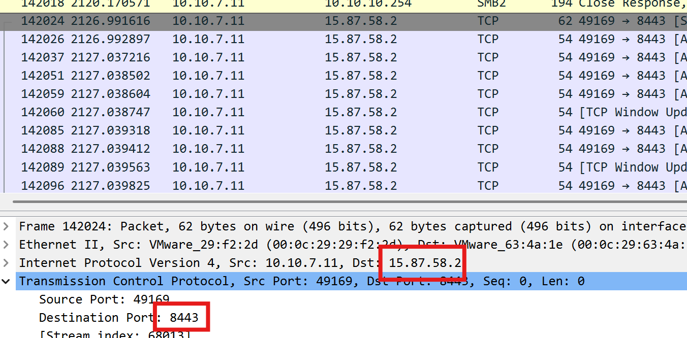

# Undercover Ops

**Score：** 200

**Challenge：**  
During the investigation, the ACME IR team identified that two files were shared with Sophia: the original PDF and an EXE. The EXE was never meant to upgrade the operating system to Windows 11, but rather it hosted a malicious, reverse-shell payload.

What IP Address and Port did this payload call back to?

Flag Format: IPAddress:Port

**Hits：**  
* Wireshark supports communication statistics

---
**Flag：**  `15.87.58.2:8443`  
**Write-Up：**
已知 Sophia 的 IP 是 `10.10.7.11`，且檔案傳輸結束大約落在封包 142018 那個時間點，推測 Sophia 在此之後執行了該檔案。

Wireshark 設定過濾條件：
```
ip.src == 10.10.7.11
```

發現封包 142018 以後的目標 IP 都是 `15.87.58.2`，目標 Port 為 `8443`。所以惡意 Payload 回連的目標位置為 `15.87.58.2:8443` 。

