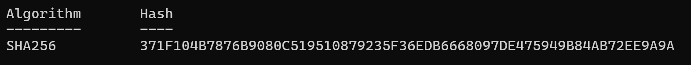
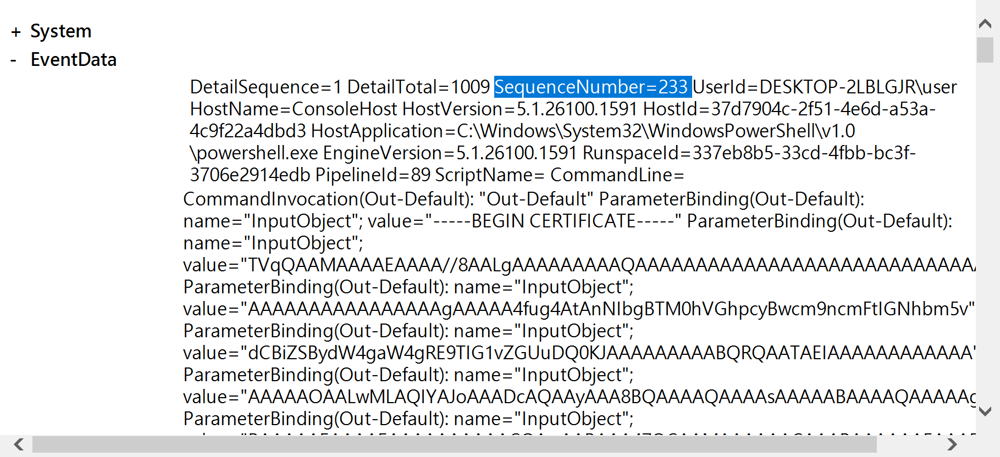
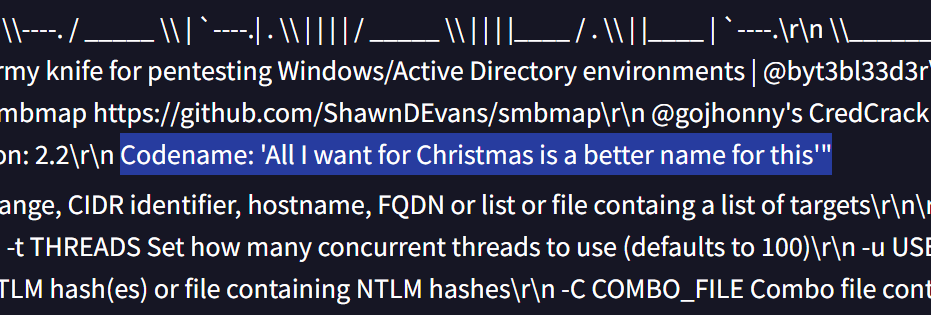

# College, it ain’t easy

**Score：** 800

**Challenge：**  
After identifying the technique the Ember Jackals used to transfer an offensive tool into the environment, we still don’t know what the tool is or what it does. Adversaries often rename or obfuscate tools to evade defenses. However, there’s a way to recover the tool and identify its true name and function. Use the Security.evtx, PowerShellLogs.evtx, or PowerShellLogs.csv files to identify the tool.

What is the codename of the tool the adversary transferred into the environment?

Flag Format: flag{lots of strings}

**Hits：**  
* The adversary already used the command to reassemble the executable. You just have to replicate it.
* This problem can be solved manually, but that will be an incredibly tedious task with 1009 sections. Try automating your analysis.

---
**Flag：**  `flag{All I want for Christmas is a better name for this}`

**Write-Up：**  
從 `Security.evtx` 中可觀察到攻擊者執行了以下指令：
```
certutil -decode lats.txt lats.exe
```
證實前題推論無誤。



接著從 `PowerShellLogs.csv` 和 `PowerShellLogs.evtx` 可以觀察到，`SequenceNumber=233` 是由多個 Base64 的 value 組成 (1009個)。



這邊利用 Python 腳本讀取 csv 檔內的 Message 欄位，並將 value 字串進行組合再解碼，得到攻擊者使用的惡意程式 `decode_paloay.exe`。

再執行以下指令，計算還原檔案的 SHA256 Hash 值，並將其上傳至 [VirusTotal](https://www.virustotal.com/gui/home/upload) 進行分析。

```
Get-FileHash .\decoded_payload.exe
```



接著在 Behavior 頁面搜尋 codename，得到 flag: `All I want for Christmas is a better name for this`。

