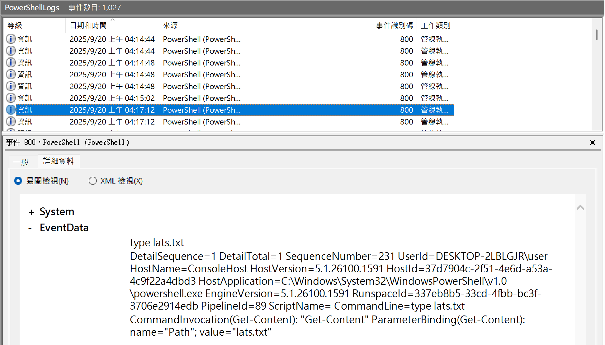
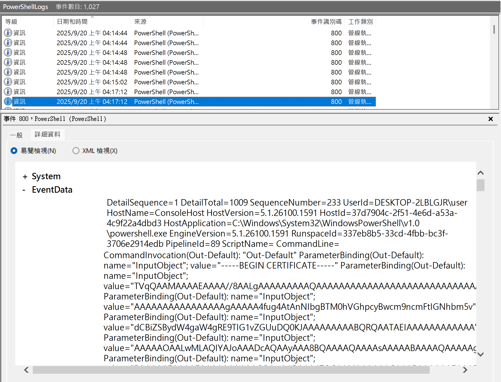

# Home Improvement

**Score：** 400

**Challenge：**  
A victim organization provided two Windows Event log files that they believe contain crucial logs containing information that shows how the adversaries brought offensive tools into the environment. They have provided you with these files for analysis.

What living-off-the-land tool did the adversary use to help bring a tool into the environment?

flag format: flag{xxxxxxxxzxxx} or xxxxxxxxzxxx

**Hits：**  
* SABLOL

---
**Flag：**  ```flag{certutil.exe}```

**Write-Up：**   
從提供的 Windows 事件記錄可見攻擊者先以 `type lats.txt` 讀取名為 `lats.txt` 的文字檔，內容包含 `-----BEGIN CERTIFICATE-----` 與大量 Base64 區塊，說明該檔案為 Base64 編碼。在 Windows 環境中，常用的內建方式是使用 ```certutil.exe -decode``` 將 Base64 文字還原為二進位檔案。以此推測攻擊者使用的 living-off-the-land 工具為 ```certutil.exe```。


