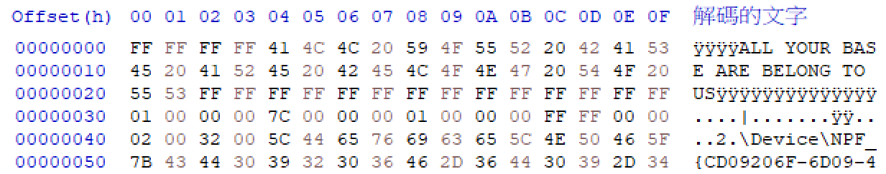
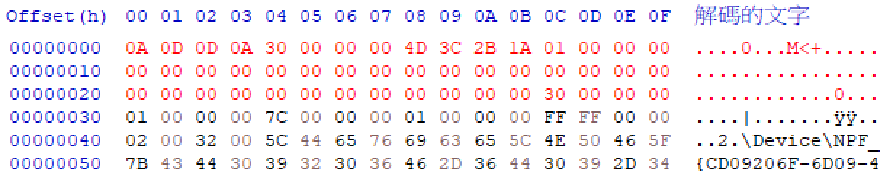
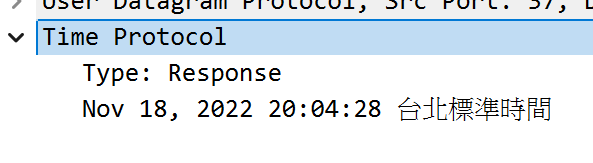

# Corrupted Network Capture

**Score：** 600

**Challenge：**  
Ember Jackals have corrupted a network capture file that may contain information on when they first began gathering info about our network. Help us restore the file to working order and recover the response data in the protocol capture.

What is the timestamp of the response packet?

Flag Format: Mmm DD, YYYY HH:MM:SS

**Hits：**  
* It looks like the beginning portion of the file is corrupted
* Recover or recreate a Section Header Block
* The timestamp must be set to the correct epoch (What epoch value does the TIME protocol use?)
* https://github.com/wireshark/wireshark/blob/8bbd491f0f39640e9ff84ec608e77e80b5021b93/epan/dissectors/packet-time.c#L69

---
**Flag：**  `Nov 18, 2022 12:04:28`  
**Write-Up：**  
利用 HxD 打開損壞的檔案，將前 48 bytes 改為：

```   
0A 0D 0D 0A 30 00 00 00 4D 3C 2B 1A 01 00 00 00
00 00 00 00 00 00 00 00 00 00 00 00 00 00 00 00
00 00 00 00 00 00 00 00 00 00 00 00 30 00 00 00 
```

- `0A 0D 0D 0A`: PCAPNG 的 Magic Number。
- `30 00 00 00`: Block Length (48 Bytes)。告訴 Wireshark 這個標頭只有 48 bytes，讀完這 48 bytes 後，請跳到 Offset 0x30 去讀下一個區塊。特別注意 Offset 0x20 末尾的 `30 00 00 00`，Wireshark 在這邊確認頭尾一致後，才會繼續往下讀。
- `4D 3C 2B 1A`: Byte Order Magic。
- `01 00 00 00`: Major Version 1.0。





接著使用 Wireshark 打開修復後的檔案，找到 response packet 的時間 (UTC+8)。



轉換成 `UTC+0`，得到 flag: `Nov 18, 2022 12:04:28`。