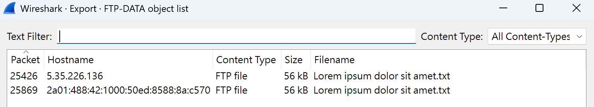
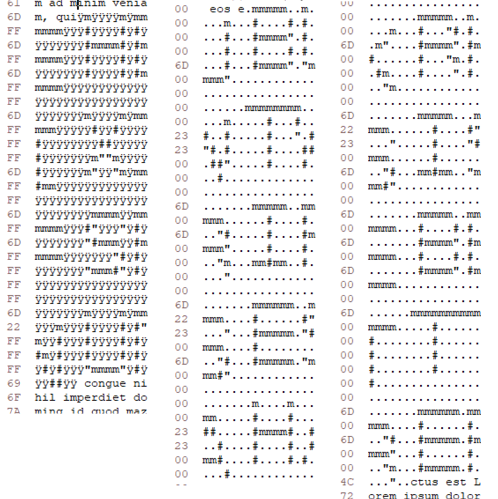
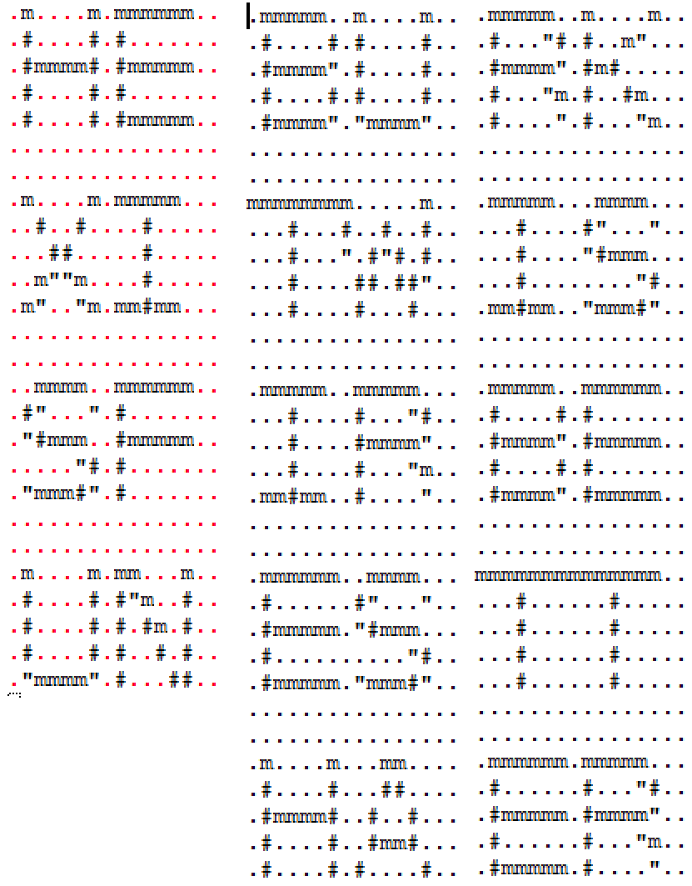

# First of Many

**Score：** 400

**Challenge：**  
The Ember Jackals have corrupted a .txt file that was retrieved over the network by one of our admins.

We need to identify the .txt file and extract out any hidden messages the Ember Jackals have graffitied inside.

Flag Format: LONGSTRINGALLTOGETHER

**Hits：**  
* There is a way to extract files detected by Wireshark in the UI.
* Finding the file transfer in Wireshark may be helpful to see what is going on.
* The file extension of the file in question is “.txt”.
* Concatenate multiple messages together, if any.

---
**Flag：** `HEXISFUNBUTWIRESHARKISBETTER`  
**Write-Up：**  
題目表明檔案格式是 `.txt` 且可以用 Wireshark UI 提取。
打開 Wireshark 點擊 `File` -> `Export Objects` -> `FTP-DATA` 找到 `.txt` 檔案保存。

利用 HxD 打開 `Lorem ipsum dolor sit amet.txt`，發現裡面有 ASCII Art。

刪除一些文字使其能夠對齊，並將十六進制的 `FF` 改為 `00`，方便查看。

組合起來得到 flag: `HEXISFUNBUTWIRESHARKISBETTER`。
