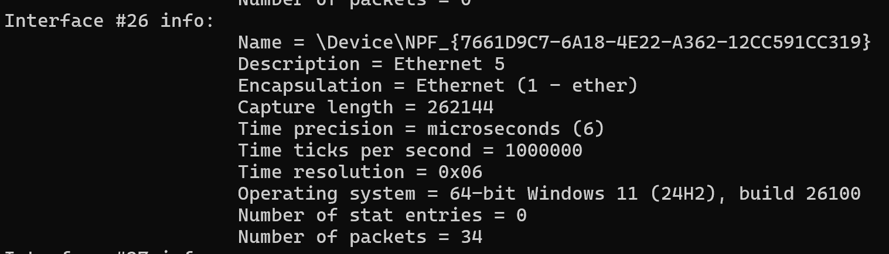

# Network Capture INT

**Score：** 400

**Challenge：**  
Would you kindly identify the full Operating System name, version, and build number of the client machine that this PCAPNG was captured on?

Flag Format: xx-bit Windows xx (xxxx), build xxxxx

Free Hint: There are more than one interface and there are multiple builds in the attached PCAP.

**Hits：**  
* Every packet is captured from a specific Interface id.
* Each Interface device has its own Interface Description Block.

---
**Flag：** 64-bit Windows 11 (24H2), build 26100  
**Write-Up：**

cd 到 Wireshark 的安裝目錄，執行以下 command：
```
.\capinfos.exe -M [path to tls.pcapng]
```
`-M` 會列出所有介面資訊。  

接著找到 Number of packets 不為 0 的 Interface，Operating system 即為 Flag。

