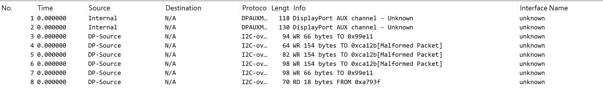
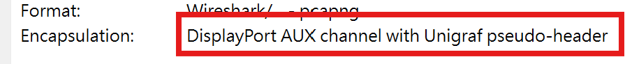
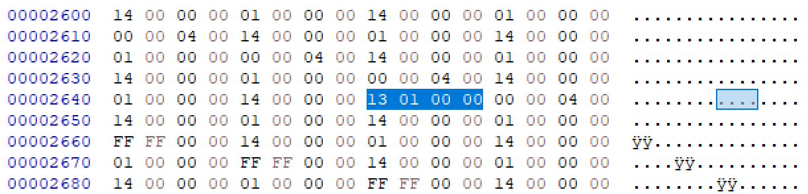
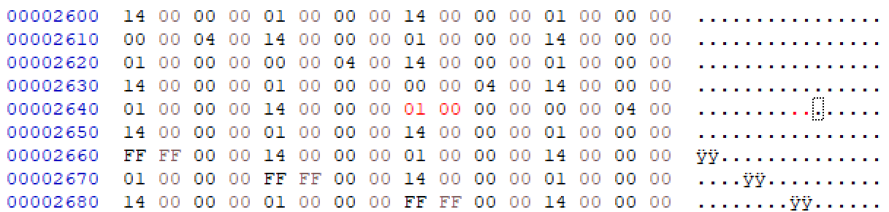
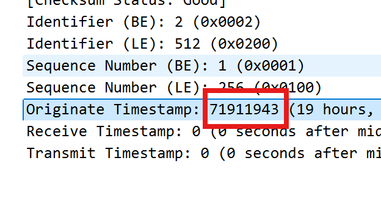

# Silly Jackals, PCAPs are for Kids!

**Score：** 800

**Challenge：**  
Ember Jackals have been probing some of our other servers. I have been able to capture some of their traffic but I think I messed up the capture somehow.

Please help make sense of the data and retrieve the 'Originate Timestamp' field from the ICMP packet so we can identify the time of day this scan occurred.

Flag Format: dddddddd

**Hits：**  
* Network captures record the LinkType the frames were captured on
* ICMP packets only operate on Ethernet network links
* The LinkType field for the correct Interface ID needs to be fixed

---
**Flag：** `71911943`  
**Write-Up：**  
從題目來看，該題首先要做的是修復檔案的 LinkType，因為目前的 LinkType 是錯誤的，導致 Wireshark 用錯誤的格式解讀。

點擊 `Statistics` -> `Capture File Properties`，看到 Encapsulation 欄位目前顯示的是 `DisplayPort AUX channel with Unigraf pseudo-header`，代表 Wireshark 目前把這些封包當作 `DisplayPort` 的訊號。

DisplayPort AUX 的 LinkType 代碼是 275 (Hex: 0x0113)。在 Little Endian 中會寫成 `13 01`。利用 HxD 打開檔案，找到 `13 01` 改為 `01 00` (Ethernet)。

保存後重新打開檔案，找到 ICMP 封包的 Originate Timestamp 欄位，得到 flag: `71911943` 。

