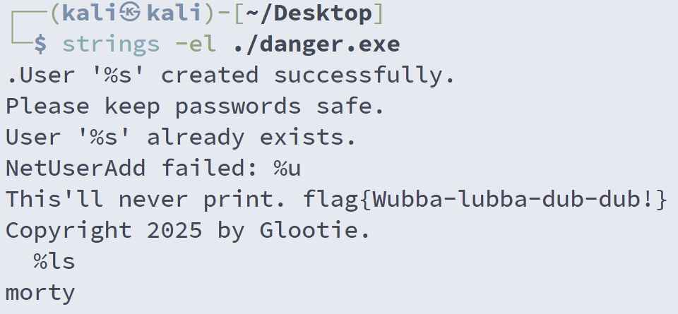

# Mortimer’s Admin Utility 1

**Score：** 400

**Challenge：**  
Note: Use this attachment to solve the next three challenges.

In a strange turn of events, the Ember Jackals hired a young Mortimer Smith as an intern and ACME found a utility he left behind on one of the systems.

First, we need to do some static analysis to make sure there’s no flag-nanigans going on here...

**Hits：**  
* Running it may be dangerous… you should just look at it.
* This is way simpler than string theory.

---
**Flag：flag{Wubba-lubba-dub-dub!}**  
**Write-Up：**  
題目提示要靜態分析，不執行檔案；提示二的 "This is way simpler than string theory"，暗示用 strings 工具。結合檔案的格式為 .exe ，應使用 strings -el（UTF-16 little-endian）來尋找 flag 或有用線索。

