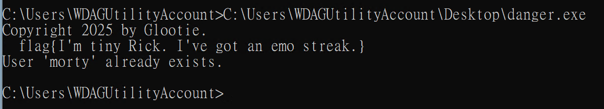

# Mortimer’s Admin Utility 2

**Score：** 600

**Challenge：**  
In a strange turn of events, the Ember Jackals hired a young Mortimer Smith as an intern and ACME found a utility he left behind on one of the systems.

Yeah it’s definitely shady, and you should definitely not run it on your work computer… but you need the flag so… YOLO!

Note: A successful run of the tool will create a new local user (if run in Admin prompt). Creation of a new user, nor Admin privileges are required to solve the flag.

Flag Format: flag{strings here}

**Hits：**  
* Hey, uh, uh, 1995 called! They want their “certain year called wanting its blank back” formula back.

---
**Flag：flag{I'm tiny Rick. I've got an emo streak.}**  
**Write-Up：**
修改系統時間到 1995 年之前，之後直接執行。
