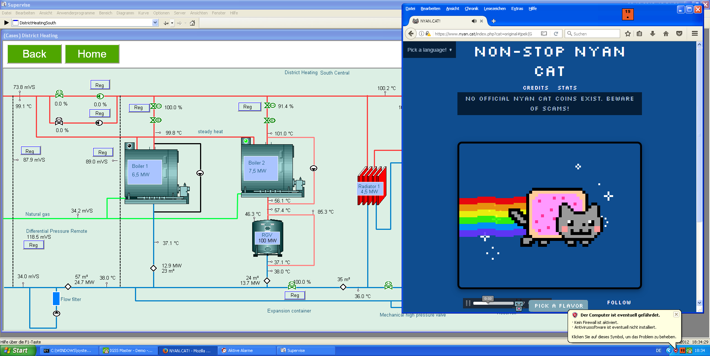

# δραπετεύω

**Score：** 600

**Challenge：**  
Note: Use the attached artifacts for the following four challenges.

We found our HMI for the heating system with an open browser Window, making a lot of noise. Someone or something has opened this. http://nyan.cat does not seem to be malicious itself, our research at http://http.cat also shows nothing weird. We successfully captured a triage collection from the system.

Can you investigate what might be off with this browser? Can we identify if someone left a “calling card”?

Flag format: flag{text}

**Hits：**  
* What artifacts would a browser produce? We dont have the full pcap. (瀏覽器會產生哪些殘留痕跡？我們沒有完整的封包擷取檔。)
* Have you looked at the screenshot? (你查看過截圖了嗎？)
* Does anything stick out? Maybe it needs some rotating. (有什麼特別顯眼的地方嗎？或許需要旋轉一下角度。)

---
**Flag：**  
**Write-Up：**